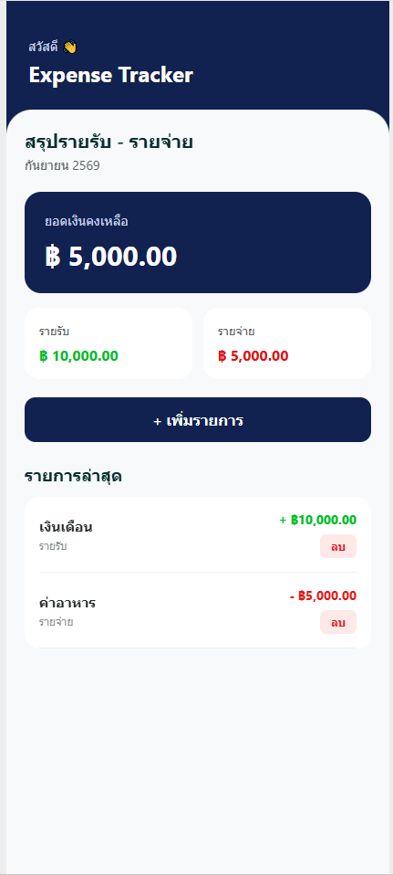
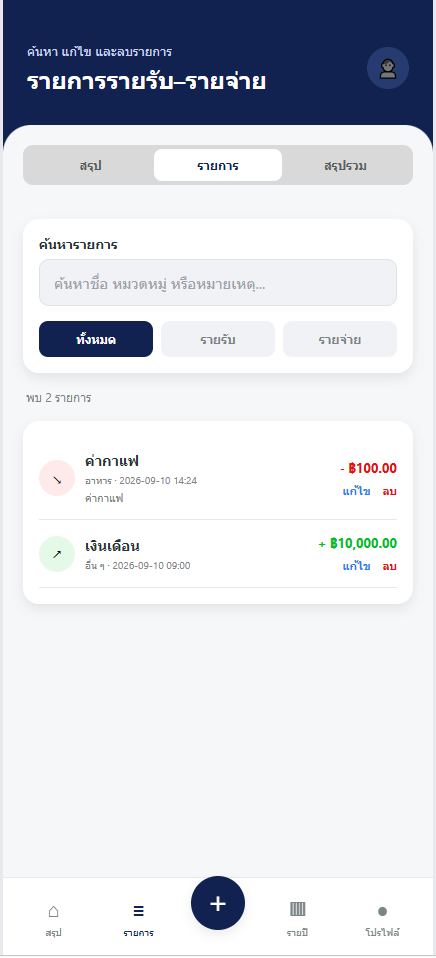
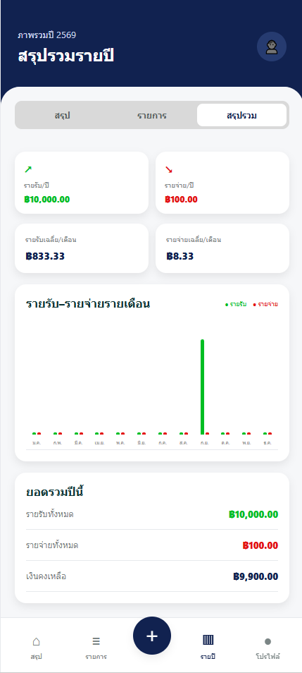
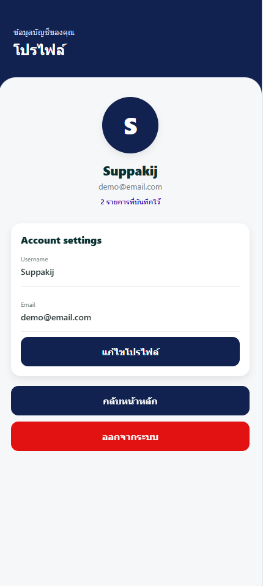

# Expense Tracker

A full-featured expense tracking application adapted from my previous Mobile Wallet design in Figma. The project demonstrates a multi-screen application built with React Native, Expo, TypeScript, Firebase Authentication, and Cloud Firestore.

## Screenshots

| Sign In | Dashboard |
| --- | --- |
|  |  |

| Transaction History | Yearly Summary | Profile |
| --- | --- | --- |
|  |  |  |

## Features

- Register and sign in with email and password
- Persistent Firebase Authentication session
- Edit user profile and sign out
- Add income and expense transactions
- Edit and delete transactions
- Select transaction type and category
- Record transaction date, time, and notes
- Automatically calculate total income, expenses, and balance
- Dashboard with spending progress and category breakdown
- Search and filter transaction history
- Yearly summary with a monthly bar chart
- Real-time transaction updates from Cloud Firestore
- User-specific data protected by Firestore Security Rules
- Responsive mobile-style interface

## Technologies Used

- React Native
- Expo
- TypeScript
- Firebase Authentication
- Cloud Firestore
- AsyncStorage for authentication persistence
- React Native Web
- Figma

## Database Structure

```text
users
└── {userId}
    ├── name
    ├── email
    └── transactions
        └── {transactionId}
            ├── title
            ├── amount
            ├── type
            ├── category
            ├── date
            ├── time
            └── note
```

Each authenticated user can access only their own profile and transactions through Firestore Security Rules.

## Design

The user interface was adapted from my previous Mobile Wallet design.

[Figma Design](https://www.figma.com/design/egtWKRnqzhsr9oyaKHvPq6/Application-mobile-Wallet?node-id=0-1)

## Installation

Clone the repository:

```bash
git clone https://github.com/Neoman99999/expense-tracker.git
cd expense-tracker
```

Install the dependencies:

```bash
npm install
```

Run the project on the web:

```bash
npm run web
```

You can create a new account from the sign-up screen and begin adding income or expense transactions.

## Security

Firestore rules require an authenticated user and restrict access to documents whose User ID matches the current Firebase Authentication UID.

The active rules are available in [`firestore.rules`](firestore.rules).

## Project Purpose

This project was created to demonstrate my ability to design and develop a functional mobile application using React Native, Expo, TypeScript, Firebase Authentication, Cloud Firestore, and Figma.