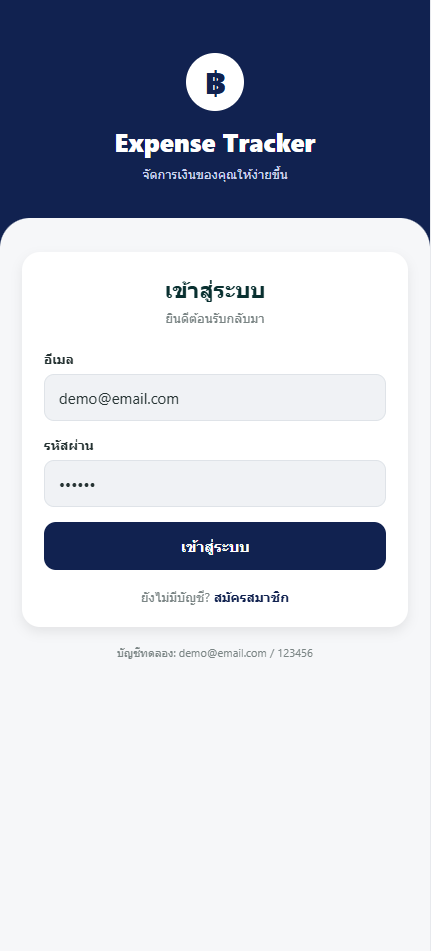

# Expense Tracker

A mobile expense tracker adapted from my previous Mobile Wallet design in Figma.  
The project demonstrates a complete multi-screen application built with React Native, Expo, and TypeScript.

## Screenshots

| Sign In | Dashboard |
| --- | --- |
|  |  |

| Transaction History | Yearly Summary | Profile |
| --- | --- | --- |
|  |  |  |

## Features

- Sign in, sign up, edit profile, and sign out
- Persistent local user session
- Add income and expense transactions
- Edit and delete transactions
- Select transaction type and category
- Record date, time, and notes
- Automatically calculate income, expenses, and balance
- Dashboard with spending progress and category breakdown
- Search and filter transaction history
- Yearly summary with a monthly bar chart
- Save transaction data locally using AsyncStorage
- Responsive mobile-style interface

## Technologies Used

- React Native
- Expo
- TypeScript
- AsyncStorage
- React Native Web
- Figma

## Design

The user interface was adapted from my previous Mobile Wallet design.

[Figma Design](https://www.figma.com/design/egtWKRnqzhsr9oyaKHvPq6/Application-mobile-Wallet?node-id=0-1)

## Installation

Clone the repository:

```bash
git clone https://github.com/Neoman99999/expense-tracker.git
cd expense-tracker
```

Install the dependencies:

```bash
npm install
```

Run the project on the web:

```bash
npm run web
```

## Demo Account

```text
Email: demo@email.com
Password: 123456
```

## Project Purpose

This project was created to demonstrate my ability to design and develop a functional mobile application using React Native, Expo, TypeScript, local data persistence, and Figma.